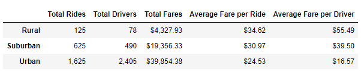
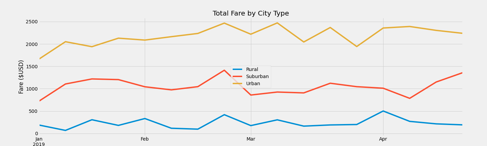

# PyBer Analysis

## Overview of Project
I am hired by Pyber, a python based ride-sharing app, to analyze their ride-sharing data. I will be using Python, Pandas, and Matplotlib to create visualizations of the data that will be analyzed. The visualizations will help the decision-makers compare how the data differs by city type and how those differences can improve the service or affordability.

### Purpose
The purpose of this assignment is to use Pandas and Matplotlib to showcase our ability to read CSV files, create DataFrames using data series, merge DataFrames, and to use these DataFrames to produce statistical calculations and visualizations. This project specifically requests to use the ride data and city data to produce a  summary DataFrame of the ride-sharing by city type. I will create a multiple-line graph that shows the total weekly fares for each city type. The city types are Urban, Suburban, and Rural.

## Results
I was given starter code to create a summary DataFrame. Using **_pandas_** and the **_groupby_** function, I read through two CSV files and merged them to generate the DataFrame. I used the **_groupby_** function to select the data series and group them into a DataFrame, by city type. Stitching the datasets together allowed me to calculate the following:
+ Total of Rides per City Type
+ Total Drivers per City Type
+ Total Sum of Fares per City Type
+ Average Fare per Ride per City Type
+ Average Fare per Driver per City Type

The figure above breaks down the ride count, driver count, fare total, and averages per driver/ride by city type. At a glance, city types such as Urban and Suburban had a larger count of drivers and rides.  As a result, they generated more revenue or fares due to higher usage amongst people in those communities. The rural city has the least amount of total rides, drivers, and total fares. However, their average fare is the highest due to fewer users and what is assumed to be less commuter-friendly distances. I will breakdown each category below.

 #### _Total Rides per City Type_
 Urban cities had the largest total of rides, 1,625 rides. That is 2.6 times greater than the suburban total and 13 times greater than the rural total. This outcome is expected because more densely populated areas have a larger pool of users to engage in Pyber's ride-sharing service.
 #### _Total Drivers per City Type_
 Urban cities had the largest total of drivers, 2,405 drivers. That is 4.9 times greater than the suburban total and 30.8 times greater than the rural total. As mentioned previously, this outcome is expected because densely populated areas generally have more people who engage in ride-sharing services.
 #### _Total Sum of Fares per City Type_
 Urban cities had the largest total of fares, a total of $39,854.38. That is 2.1 times greater than the suburban total and 9.2 times greater than the rural total. This outcome is expected.
 #### _Average Fare per Ride per City Type_
 Rural cities had the highest average fare per ride, $34.62. This is 1.4 times greater than the urban average and 1.1 times greater than the suburban average. Multiple factors could affect this higher fare price. Rural cities generally are not commuter-friendly since the population is spread out over less populated land. The fare may be factoring in the distance traveled. There are also fewer people in the area to use the service. If there is no demand for the service, there is less opportunity for a driver to make money. The fare is possibly increased to compensate the driver for the lack of trips they can complete within a day. Low demand creates a shortage of drivers. As a result, the small number of people who use the service pay a higher fare due to the low supply of drivers.
 #### _Average Fare per Driver per City Type_
 Rural cities had the highest average fare per driver, $55.49. This is 3.4 times greater than the urban average and 1.4 times greater than the suburban average. There is less competition for drivers in rural cities. Therefore, these drivers receive better compensation since their availability directly impacts the price fluctuation. Urban cities are saturated with drivers. So long as there is a  high availability of drivers, prices stay affordable and competitive to attract users. When there is a shortage of drivers in the city due to high usage hours, ride-sharing services increase their fares to match the increasing demand.
**Total Fare by City Type**

This multiple-line graph shows how fare prices per city type fluctuate between January to the end of April.  It specifically displays the total fare per city reported each week. The data is not too telling as there are no standout data points on the line graph. The fares stay pretty stagnant and relatively close to their average fare totals per week. The only period that sees a noticeable increase in fares for all cities is toward the last week of February. All city types saw at least a $500 increase in fare totals that week.

## Summary
Based on the completed data analysis, the following business recommendations address the imbalances between the city type markets:

**1.** Do not allocate more resources towards expanding into rural cities. Multiple non-controllable factors prevent opportunity growth in these already difficult areas. Speaking from personal experience, people in rural areas chose to support local businesses over corporations. Our competition in these areas will be the local taxi drivers who have been canvassing the area for business for generations. People are more willing to pay 55 dollars to the taxi driver because it helps the local economy. Instead, partner with the local taxi drivers and offer them the option to use the ride-sharing service as a supplemental platform to increase their trips per day. Using our ride-sharing service brings them a more tech-savvy and instantly gratified demographic of users who would not normally call them for a ride. The goal is to organically increase the number of drivers in rural areas to lower the high fare barrier. By increasing driver supply and giving income opportunities to the drivers who have a grip on the local market, we would overcome two of the largest barriers that deter us from reaching new users.

**2.** For urban and suburban cities, look for ways to increase the average fare per driver. The two city types are over-saturated with drivers and ride-sharing services. In a market full of ride-sharing services, drivers seek to work for a company that generates a steady flow of rides or compensates them fairly. If the average fare per ride is relatively affordable and competitive with other prices, users are more attracted to use our services. Perhaps we do not increase the average fare per driver. Instead, we incentivize a driver to meet a semi-aggressive quota of rides per week to receive a hefty bonus. Additionally, if a driver consistently hits their quotas, they earn larger percentages of their wages. As we add more drivers to our fleet, we can begin to change the landscape of driver availability and reach more people with our services.

**3.** I believe our largest opportunity for growth is the Suburban city. Rural cities' fares total and total rides are far below the numbers of urban cities. Urban cities are over-saturated with drivers. The market is also over-competitive. Suburban is the happy medium of affordability for users and drivers to earn a higher fare per ride. Suburban areas have people who commute to the city for work and leisure. Suburban areas undergo the most development and experience a fluctuation of population increase year over year. I believe more people will move to the suburbs. The opportunity to engage with new users will increase as more restaurants, bars, and shopping centers are developed. I suggest we increase our drivers in the suburbs to increase our presence in the market share. Paired with the suggestion I made earlier, find a way to keep prices affordable for users while also rewarding drivers for their hard work.
